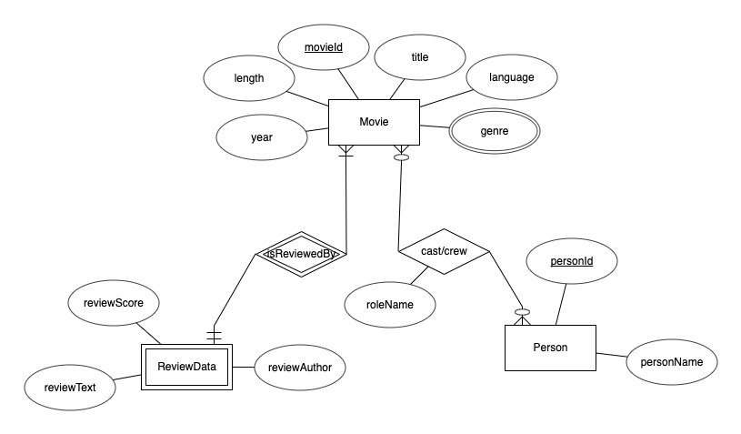

## ER Model

## Relational Schema
- MovieTable(titleId:INT\[PK\], titleName:VARCHAR(256), year:INT, length:INT, language:INT)
- GenresTable(genreId:INT\[PK\], genreName:VARCHAR(64)\[PK\])
- MovieGenresTable(genreId:INT\[FK to GenresTable.genreId\], movieId:INT\[FK to MovieTable.movieId\])
- PersonTable(personId:INT\[PK\], personName:VARCHAR(256))
- CrewTable(movieId:INT\[FK to MovieTable.movieId\], castId:INT\[FK to PersonTable.personId\], roleName:VARCHAR(128))
- ReviewsTable(movieId:INT\[FK to MovieTable.movieId\], rating:INT, reviewText:VARCHAR(1024))
